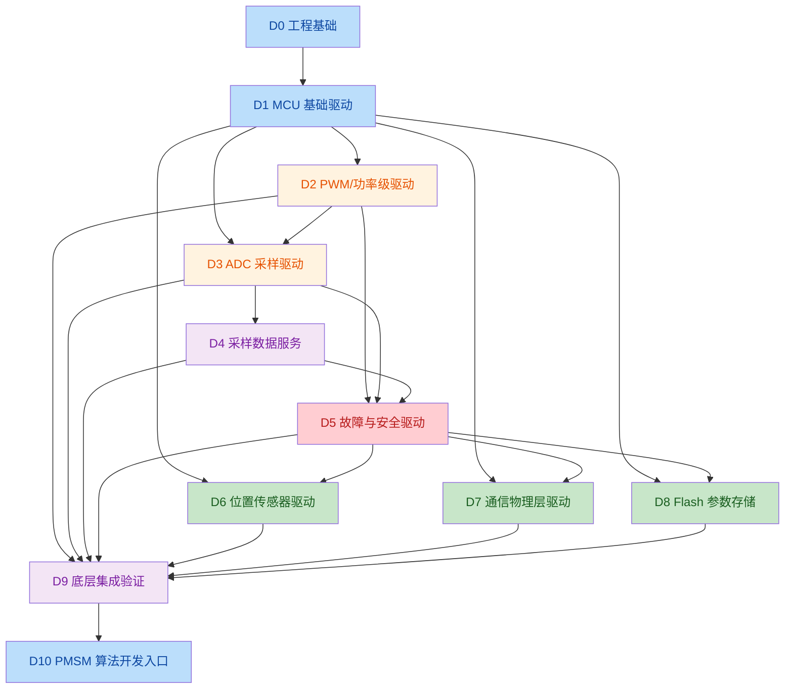

# PMSM 底层软件驱动实现顺序表

**版本**：v0.1
**适用平台**：STM32F407IGT6 + STM32CubeMX + STM32 HAL + CMake
**适用硬件**：ATK-DMF407 MCU 控制板 + ATK-PD6010B 功率驱动板
**文档范围**：仅定义底层驱动的实现顺序、阶段划分、依赖关系和阶段出口
**不包含**：各驱动的详细接口、寄存器配置、算法方案和具体测试用例
**当前审查范围**：`software/PMSM_FOC` 工程 D0～D2 阶段实施状态；D1 基础项已完成验证，D2 正在进行实现审查

---

## 1. 总体目标

在开始 PMSM 控制算法、应用状态机和 VESC Tool 协议开发之前，先完成底层驱动的分层实现和硬件验证。

总体顺序：

```text
工程基础
    ↓
MCU 基础驱动
    ↓
功率级输出驱动
    ↓
ADC 采样驱动
    ↓
采样数据服务
    ↓
故障与安全驱动
    ↓
位置传感器驱动
    ↓
通信物理层驱动
    ↓
Flash 参数存储驱动
    ↓
底层集成测试与冻结
    ↓
PMSM 算法层
```

核心原则：

1. 先完成无功率输出的基础驱动验证；
2. 再验证 PWM、Gate、Break 等功率级相关驱动；
3. 再验证 ADC、DMA 和采样时序；
4. 再完成位置、通信和存储等支撑驱动；
5. 底层驱动通过集成测试后，才进入 FOC 算法开发；
6. 每个阶段完成后形成可回归的版本基线。

---

## 2. 驱动实现阶段总表

| 阶段 | 阶段名称     | 主要驱动范围                                   | 前置依赖   | 阶段目标                      |
| ---- | ------------ | ---------------------------------------------- | ---------- | ----------------------------- |
| D0   | 工程基础     | CMake、CubeMX、启动、链接、编译配置            | 无         | 工程可编译、可下载、可启动    |
| D1   | MCU 基础     | 时钟、GPIO、NVIC、SysTick、DMA、IWDG           | D0         | MCU 基础资源稳定可用          |
| D2   | 功率级输出   | PWM、互补输出、Dead Time、Gate/SD、Break       | D1         | 功率输出可控且可安全关闭      |
| D3   | ADC 采样     | ADC 注入组、规则组、DMA、ADC 中断              | D1、D2     | 采样链路和触发关系可验证      |
| D4   | 采样服务     | 电流原始数据、电流偏置、母线电压、温度         | D3         | 原始 ADC 数据转换为可靠物理量 |
| D5   | 故障安全     | Break 故障、Gate Fault、过流、过压、欠压、过温 | D2、D3、D4 | 故障可检测、关断、记录和锁存  |
| D6   | 位置传感器   | 编码器、霍尔、SPI 位置传感器等                 | D1、D5     | 位置和速度数据可稳定获取      |
| D7   | 通信物理层   | UART、CAN、USB 等底层收发                      | D1、D5     | 通信链路稳定，不包含上层协议  |
| D8   | 参数存储     | Flash 读写、擦除、CRC、版本管理基础            | D1、D5     | 参数可可靠保存和恢复          |
| D9   | 底层集成验证 | 所有底层驱动集成、时序、异常和安全验证         | D2～D8     | 形成底层驱动冻结基线          |
| D10  | 算法开发入口 | FOC 所需底层接口冻结                           | D9         | 允许进入 PMSM 算法层开发      |

### 当前阶段状态

| 阶段 | 审查结论                                                                                                                                                                                                                         | 状态                         |
| ---- | -------------------------------------------------------------------------------------------------------------------------------------------------------------------------------------------------------------------------------- | ---------------------------- |
| D0   | 已完成基础工程实施：CubeMX`.ioc`、CMake 目标、启动文件、链接脚本、HAL/CMSIS 源码和 Debug 构建目录均已存在；当前构建环境未安装或未加入 PATH 的 `cmake` 命令，因此仅能确认工程文件已配置，不能在本次审查中完成命令行构建验证。 | 已完成（构建命令待环境验证） |
| D1   | 时钟、电源、GPIO、SysTick、DMA 和 IWDG 已完成配置；NVIC、ADC、DMA、TIM1 Break/Update 中断入口已完成板级验证；IWDG 服务、复位原因读取及 D1 基础验证项均已完成并验证。 | 已完成（基础项已验证） |
| D2   | 已建立 PowerStage v0.2 状态框架；v0.3 已实现六路 PWM 停止和 Gate/SD 关闭；v0.4 已实现固定占空比装载、六路 PWM 启动和 CCR 更新；v0.5 已实现 TIM1 Break 回调、故障锁存和 Break 标志清除条件检查。Gate/SD 开启已接入 PWM 成功启动路径；v0.6 已增加无高压示波器验证接口并在 main 初始化后调用，同时启动 TIM1 CH4 作为 ADC2 注入转换触发源；实际波形验证和清除后的重新启动流程仍未完成。 | 部分完成 |

---

## 3. 详细实现顺序

### D0：工程基础

| 顺序 | 驱动/模块                    | 状态                         |
| ---: | ---------------------------- | ---------------------------- |
|    1 | STM32CubeMX`.ioc` 工程     | 已完成                       |
|    2 | CMake 工程和工具链           | 已配置                       |
|    3 | STM32F407 启动文件和链接脚本 | 已完成                       |
|    4 | HAL/CMSIS 基础库             | 已完成                       |
|    5 | Debug/Release 构建配置       | Debug 已配置，Release 待验证 |
|    6 | 固件下载和基本启动           | 待实机验证                   |

**阶段出口**：固件能够编译、链接、下载并进入 `main()`。

---

### D1：MCU 基础驱动

| 顺序 | 驱动/模块             | 状态                     |
| ---: | --------------------- | ------------------------ |
|    1 | 时钟和电源配置        | 已完成并验证             |
|    2 | GPIO 基础配置         | 已完成并验证             |
|    3 | NVIC 中断基础配置     | 已完成并验证             |
|    4 | SysTick/HAL 时间基准  | 已完成并验证             |
|    5 | DMA 基础配置          | 已完成并验证             |
|    6 | IWDG 初始化和服务框架 | 已完成并验证             |
|    7 | 复位原因读取          | 已完成并验证             |

**阶段出口**：MCU 基础资源经过板级验证，后续驱动可以依赖统一的时钟、GPIO、DMA 和中断环境。

---

### D2：功率级输出驱动

**完善落地方案**：[PMSM D2 功率级输出驱动完善落地方案](PMSM_D2_Power_Stage_Output_Driver_Implementation_Plan_v0.1.md)

| 顺序 | 驱动/模块             | 当前状态 | 工程证据/结论 |
| ---: | --------------------- | -------- | ------------- |
|    1 | TIM1 基础计数配置     | 已配置   | TIM1 使用 168 MHz 定时器时钟、中心对齐计数、10 kHz PWM 参数和自动重装载预装载。 |
|    2 | 三相高侧 PWM 输出     | 已配置   | PA8/PA9/PA10 已映射 TIM1_CH1/CH2/CH3，通道参数已生成。 |
|    3 | 三相低侧互补 PWM 输出 | 已配置   | PB13/PB14/PB15 已映射 TIM1_CH1N/CH2N/CH3N，互补通道参数已生成。 |
|    4 | Dead Time 配置        | 已配置   | TIM1 Break/Dead-Time 配置中已设置 DeadTime=84。具体时间换算和示波器验证仍待完成。 |
|    5 | PWM 输出使能/禁止     | 停止已实现，启动未实现 | `PowerStage_StopPwm()` 已统一停止三相主输出和互补输出；尚未实现 PWM 启动接口。 |
|    6 | Gate/SD 控制          | 关闭已实现，开启未实现 | `PowerStage_DisableGate()` 已将 `PM1_CTRL_SD` 写入关闭电平；尚无 Gate 开启接口。 |
|    7 | TIM1 Break 输入       | 关断和锁存已实现，清除未实现 | TIM1 Break 中断路径已调用 `PowerStage_BreakHandler()`，执行 PWM/Gate 关闭并锁存故障；尚无硬件条件确认和受控清除。 |
|    8 | PWM 安全启动和停止    | 停止路径已实现，启动未实现 | 初始化和 `PowerStage_Stop()` 均执行 PWM 停止及 Gate 关闭；尚无启动前置条件和 Gate 联锁。 |
|    9 | PWM 占空比更新接口    | 未实现   | 当前占空比仅在初始化中写入固定 Pulse 值，尚无运行时三相占空比更新接口。 |

**阶段出口**：尚未达到。当前只能确认 TIM1、六路互补输出、Break、死区和 Gate/SD 的基础配置存在；必须完成 PWM 控制接口、Gate 安全控制、Break 故障路径以及无高压条件下的板级波形验证后，才能进入 D3 正式采样联调。

---

### D3：ADC 采样驱动

| 顺序 | 驱动/模块              | 状态         |
| ---: | ---------------------- | ------------ |
|    1 | ADC1 规则组初始化      | 已有基础配置 |
|    2 | ADC1 DMA 传输          | 已有基础配置 |
|    3 | ADC2 注入组初始化      | 已有基础配置 |
|    4 | TIM1_CH4 ADC 触发链路  | 已有基础配置 |
|    5 | ADC 注入转换完成中断   | 待完善       |
|    6 | ADC 规则组完成回调     | 待完善       |
|    7 | ADC 原始数据缓冲管理   | 待实施       |
|    8 | ADC 采样超时和异常检测 | 待实施       |

**阶段出口**：确认三相电流、母线电压和 MOS 温度的 ADC 通道、Rank、触发频率、DMA 数据和中断时序正确。

---

### D4：采样数据服务

| 顺序 | 驱动/模块              | 状态   |
| ---: | ---------------------- | ------ |
|    1 | 三相电流原始值读取     | 待实施 |
|    2 | 三相电流零偏校准       | 待实施 |
|    3 | ADC 原始值到相电流换算 | 待实施 |
|    4 | 母线电压换算           | 待实施 |
|    5 | MOS 温度换算           | 待实施 |
|    6 | 采样数据滤波           | 待实施 |
|    7 | 采样数据范围检查       | 待实施 |
|    8 | 采样数据有效性状态     | 待实施 |

**阶段出口**：可以稳定获取带单位、带有效性状态的电流、电压和温度数据，但不执行 FOC 算法。

---

### D5：故障与安全驱动

| 顺序 | 驱动/模块              | 状态        |
| ---: | ---------------------- | ----------- |
|    1 | TIM1 Break 故障处理    | 待实施      |
|    2 | Gate Driver Fault 输入 | 待确认/实施 |
|    3 | 过流故障               | 待实施      |
|    4 | 母线过压故障           | 待实施      |
|    5 | 母线欠压故障           | 待实施      |
|    6 | MOS 过温故障           | 待实施      |
|    7 | ADC 采样异常故障       | 待实施      |
|    8 | 故障记录               | 待实施      |
|    9 | 故障锁存               | 待实施      |
|   10 | 故障清除和受控恢复     | 待实施      |
|   11 | 安全停机路径           | 待实施      |

**阶段出口**：任何关键故障都能使 PWM/Gate 进入安全状态，并且软件可以记录、锁存和诊断故障原因。

---

### D6：位置传感器驱动

根据实际硬件选择一种或多种实现：

| 顺序 | 驱动/模块            | 状态   |
| ---: | -------------------- | ------ |
|    1 | 位置传感器接口确认   | 待确认 |
|    2 | ABI 编码器驱动       | 待确认 |
|    3 | 霍尔传感器驱动       | 待确认 |
|    4 | SPI 磁编码器驱动     | 待确认 |
|    5 | 机械角度读取         | 待实施 |
|    6 | 电角度计算           | 待实施 |
|    7 | 速度计算             | 待实施 |
|    8 | 位置有效性和故障检测 | 待实施 |

**阶段出口**：可以稳定获取位置、方向和速度数据，并能检测位置传感器异常。

---

### D7：通信物理层驱动

| 顺序 | 驱动/模块          | 状态        |
| ---: | ------------------ | ----------- |
|    1 | UART 基础收发      | 待确认/实施 |
|    2 | UART 中断或 DMA    | 待确认/实施 |
|    3 | CAN 基础收发       | 待确认/实施 |
|    4 | CAN 接收过滤       | 待确认/实施 |
|    5 | CAN 错误和 Bus-Off | 待确认/实施 |
|    6 | USB CDC（如采用）  | 待确认/实施 |
|    7 | 通信超时检测       | 待实施      |
|    8 | 通信物理层状态     | 待实施      |

**阶段出口**：至少一种目标通信链路完成稳定收发、错误检测和超时检测，但不实现 VESC 命令解析。

---

### D8：Flash 参数存储驱动

| 顺序 | 驱动/模块          | 状态   |
| ---: | ------------------ | ------ |
|    1 | Flash 地址规划     | 待实施 |
|    2 | Flash 读操作       | 待实施 |
|    3 | Flash 擦除操作     | 待实施 |
|    4 | Flash 写操作       | 待实施 |
|    5 | 数据长度和边界检查 | 待实施 |
|    6 | 参数 CRC           | 待实施 |
|    7 | 参数版本和默认值   | 待实施 |
|    8 | 参数恢复           | 待实施 |
|    9 | 掉电/异常写入处理  | 待实施 |

**阶段出口**：参数可以可靠读取、写入、校验和恢复，且不会影响实时控制中断。

---

### D9：底层集成验证

| 顺序 | 集成项目                 | 状态   |
| ---: | ------------------------ | ------ |
|    1 | MCU 基础驱动集成         | 待实施 |
|    2 | PWM/Gate/Break 集成      | 待实施 |
|    3 | ADC/DMA/采样服务集成     | 待实施 |
|    4 | 故障安全链路集成         | 待实施 |
|    5 | 位置传感器集成           | 待实施 |
|    6 | 通信物理层集成           | 待实施 |
|    7 | Flash 存储集成           | 待实施 |
|    8 | 中断优先级和执行时间验证 | 待实施 |
|    9 | 看门狗和复位恢复验证     | 待实施 |
|   10 | 长时间运行验证           | 待实施 |

**阶段出口**：底层驱动形成可重复构建、可重复测试、可记录故障和可安全停机的稳定基线。

---

### D10：算法开发入口

只有 D9 完成后，才进入算法和应用开发：

| 进入条件                | 状态   |
| ----------------------- | ------ |
| PWM 输出时序冻结        | 待确认 |
| ADC 触发和采样时序冻结  | 待确认 |
| 三相电流换算冻结        | 待确认 |
| 母线电压和温度换算冻结  | 待确认 |
| Break/Gate 安全策略冻结 | 待确认 |
| 位置传感器接口冻结      | 待确认 |
| 故障码和状态接口冻结    | 待确认 |
| 通信底层接口冻结        | 待确认 |
| Flash 参数接口冻结      | 待确认 |
| 底层测试记录完整        | 待确认 |

进入 D10 后，才开始：

```text
Clarke/Park
    ↓
Id/Iq 电流环
    ↓
SVPWM
    ↓
速度环/位置环
    ↓
PMSM 状态机
    ↓
VESC Tool 协议和应用功能
```

---

## 4. 驱动依赖关系



---

## 5. 底层驱动完成后的版本规划

| 版本 | 内容                   | 目标               |
| ---- | ---------------------- | ------------------ |
| v0.3 | 工程基础和 MCU 驱动    | 工程稳定启动       |
| v0.4 | PWM、Gate、Break 驱动  | 功率输出安全可控   |
| v0.5 | ADC、DMA 和采样服务    | 采样链路可验证     |
| v0.6 | 故障、保护和监控       | 故障安全路径完整   |
| v0.7 | 位置、通信、Flash 驱动 | 控制器外围资源完整 |
| v0.8 | 底层集成测试           | 底层驱动冻结       |
| v0.9 | FOC 算法接口接入       | 进入算法开发       |
| v1.0 | 控制和 VESC Tool 应用  | 形成基础可用系统   |

---

## 6. 当前工程对应状态

基于当前 `PMSM_FOC` 工程，已存在基础配置的项目：

```text
[已配置] TIM1 中心对齐计数、10 kHz 基础参数
[已配置] TIM1 六路互补 PWM 引脚和通道
[已配置] TIM1 Dead Time、Break 输入和关闭状态参数
[部分完成] Gate/SD GPIO 默认关闭电平
[未实现] PWM 启停和运行时占空比更新接口
[未实现] Break 故障回调、锁存和受控恢复
[已配置] ADC1 规则组
[已配置] ADC1 DMA
[已配置] ADC2 三相电流注入组
[已配置] TIM1_CH4 ADC 触发选择
[已配置] IWDG
[已配置] ADC/TIM/DMA 中断入口
```

D0、D1 审查结论：

```text
D0：工程文件和构建配置已建立，归类为“已完成”；下载、实机启动和 Release 构建仍需验证。
D1：时钟、电源、GPIO、SysTick、DMA、IWDG、NVIC 中断入口、IWDG 服务和复位原因读取均已完成；用户已确认 D1 所有基础项完成验证。
D1：整体归类为“已完成（基础项已验证）”，允许进入 D2 功率级输出驱动实施。
D2：TIM1、六路互补 PWM 引脚、Dead Time、BKIN 和 Gate/SD 默认 GPIO 已完成基础配置审查；PWM 启停、占空比更新、Gate 独立控制、Break 故障处理和板级功率波形验证尚未完成。
D2：整体归类为“部分完成”，不得进入 D3 正式采样联调。
```

仍属于驱动实现阶段的项目：

```text
[待实现] PWM 安全启动/停止接口
[部分完成] Gate/SD 驱动接口（已有默认 GPIO 电平，缺少独立控制接口和状态管理）
[待实现] Break 故障锁存和安全停机
[待实现] ADC 注入数据读取接口
[待实现] ADC 规则组 DMA 数据管理
[待实现] 电流零偏校准
[待实现] 电流、电压、温度物理量换算
[待实现] 采样异常检测
[已完成] IWDG 服务和复位原因管理
[待确认] 位置传感器驱动
[待确认] 栅极驱动器驱动
[待确认] UART/CAN/USB 物理层驱动
[待实现] Flash 参数存储驱动
[待实现] 底层集成测试
```

---

## 7. 文档使用规则

本文件只用于确定“先做什么、后做什么”。后续每个驱动开始实施前，单独建立对应的：

- 驱动需求说明；
- 接口定义；
- 状态和错误码；
- 初始化顺序；
- 中断和任务边界；
- 测试方案；
- 验收标准；
- 版本变更记录。

在没有形成对应驱动的具体方案前，不应直接把该驱动的实现代码混入 FOC 或 VESC 应用层。
