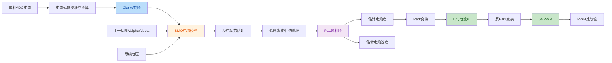
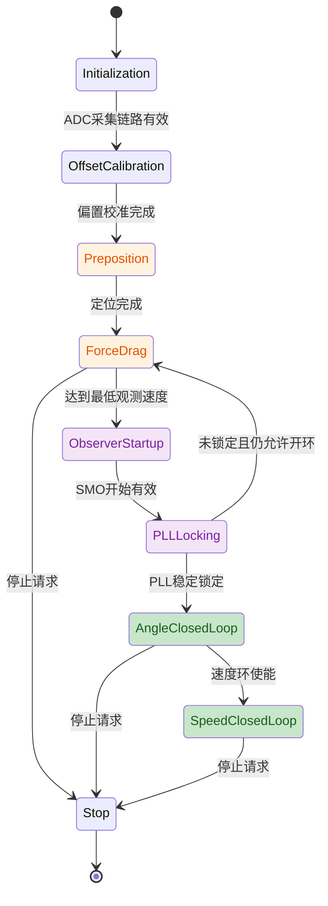

# FOC滑膜观测器与PLL无感角度、速度估计方案

## 1. 文档目的

本文档基于当前电机控制工程架构，设计一套反电动势滑膜观测器（Sliding Mode Observer，SMO）与PLL锁相环相结合的无感位置、速度估计方案。

本方案只定义算法、接口、调用时序、状态切换和验证方法，暂不修改现有控制代码。

目标是为后续角度闭环和速度闭环提供：

- 估计电角度；
- 估计电角速度；
- 估计机械转速；
- 观测器锁定状态；
- 开环强拖到无感闭环的平滑切换能力。

## 2. 当前工程架构

当前工程已经具备10 kHz快速控制基础链路：

```text
TIM1更新中断
    -> HAL_TIM_PeriodElapsedCallback()
    -> 电机状态分派
    -> FocIfStart_Preposition()/FocIfStart_ForceDrag()
    -> 三相电流采样
    -> Clarke
    -> Park
    -> D/Q电流PI
    -> 电压圆限幅
    -> 反Park
    -> SVPWM
    -> PWM比较值更新
```

相关模块：

| 模块 | 当前职责 |
|---|---|
| `AdcService` | ADC原始数据采集 |
| `FocIfStart` | I/F预定位、开环强拖、电流采样和电流闭环 |
| `FocVfStart` | V/F预定位和开环强拖 |
| `FocAlgorithm` | Clarke、Park、反Park、SVPWM和电压圆限幅 |
| `FocPiController` | D/Q轴电流PI控制 |
| `EncoderService` | 编码器位置、速度计算，可作为调试基准 |
| `MotorControl` | 电机状态机、启动模式和停止控制 |
| `ServiceCallback` | 10 kHz定时器回调和快速控制调用 |

当前 `MOTOR_STATE_ANGLE_CLOSED_LOOP` 和 `MOTOR_STATE_SPEED_CLOSED_LOOP` 仍是后续扩展入口，尚未形成完整的无感闭环快速控制流程。

## 3. 方案总体结构

SMO用于根据电机模型估计反电动势，PLL根据反电动势矢量提取连续的电角度和电角速度。



## 4. 推荐模块划分

建议新增独立的 `FocSmObserver` 模块，不将观测器状态直接分散到 `FocIfStart` 或 `MotorControl` 中。

建议文件：

```text
FOC/FocSmObserver.c
FOC/FocSmObserver.h
```

模块职责：

- 维护SMO内部状态；
- 根据电流和电压更新观测器；
- 计算反电动势估计值；
- 执行反电动势滤波；
- 执行PLL角度和速度估计；
- 处理角度归一化；
- 判断观测器是否锁定；
- 提供复位接口。

不建议由 `FocSmObserver` 负责：

- PWM比较值更新；
- D/Q电流PI；
- SVPWM；
- 启动状态机切换；
- 编码器驱动。

## 5. 观测器输入输出

### 5.1 输入量

每个10 kHz控制周期输入：

```text
Ialpha      Alpha轴电流，单位A
Ibeta       Beta轴电流，单位A
Valpha      Alpha轴电压，单位V
Vbeta       Beta轴电压，单位V
Vbus        母线电压，单位V
```

其中：

- `Ialpha/Ibeta` 来自三相电流经过 Clarke 变换的结果；
- `Valpha/Vbeta` 推荐使用上一控制周期实际提交的电压指令；
- `Vbus` 使用与SVPWM一致的母线电压；
- 所有输入必须属于同一控制周期的数据快照。

### 5.2 输出量

```text
ElectricalAngle      估计电角度，单位rad或内部相位格式
ElectricalSpeedRadS  估计电角速度，单位rad/s
MechanicalSpeedRpm   估计机械转速，单位rpm
BemfAlpha            Alpha轴反电动势估计值，单位V
BemfBeta             Beta轴反电动势估计值，单位V
IsLocked             PLL锁定状态
IsValid              观测器输出有效状态
```

内部角度格式建议统一。若现有 `FocTrig_GetSinCos()` 使用 `uint16_t` 相位值，则观测器内部可以使用弧度计算，输出时统一转换为工程已有的相位格式，避免在不同模块之间混用角度单位。

## 6. 反电动势滑膜观测器设计

### 6.1 电机模型

在静止两相坐标系下，忽略磁阻变化和高频非理想因素，定子电压模型为：

```text
Valpha = R × Ialpha + L × dIalpha/dt + Ealpha
Vbeta  = R × Ibeta  + L × dIbeta/dt  + Ebeta
```

其中：

```text
R      定子电阻
L      定子电感
Ealpha Alpha轴反电动势
Ebeta  Beta轴反电动势
```

电机参数应与当前PI控制器采用的参数模型保持一致。线间参数和星形相参数的折算必须统一，不能在PI和SMO中使用不同的电阻、电感口径。

### 6.2 离散化模型

推荐使用电流状态观测器：

```text
Ialpha_hat(k+1) = Ialpha_hat(k)
                + Ts/L × (Valpha
                - R × Ialpha_hat
                - Zalpha)

Ibeta_hat(k+1)  = Ibeta_hat(k)
                + Ts/L × (Vbeta
                - R × Ibeta_hat
                - Zbeta)
```

电流误差：

```text
Salpha = Ialpha_hat - Ialpha
Sbeta  = Ibeta_hat - Ibeta
```

滑膜控制量：

```text
Zalpha = Kslide × sat(Salpha / Phi)
Zbeta  = Kslide × sat(Sbeta / Phi)
```

其中：

- `Ts`：10 kHz控制周期；
- `Kslide`：滑膜增益；
- `Phi`：边界层厚度；
- `sat()`：饱和函数，用于替代理想符号函数，降低抖振。

饱和函数定义为：

```text
sat(x) =  1,  x > 1
          x, -1 <= x <= 1
         -1,  x < -1
```

### 6.3 反电动势提取

滑膜控制量经过低通滤波后得到反电动势估计值：

```text
Ealpha_hat = LPF(Zalpha)
Ebeta_hat  = LPF(Zbeta)
```

低通滤波器建议采用一阶离散形式：

```text
Y(k) = Y(k-1) + Klf × (X(k) - Y(k-1))
```

其中：

```text
Klf = Ts × 2π × Fcut / (1 + Ts × 2π × Fcut)
```

`Fcut` 应高于最大电频率对应的反电动势变化频率，同时低于PWM开关频率，以在动态响应和抖振抑制之间取得平衡。

### 6.4 电压输入处理

观测器需要使用实际施加到电机绕组的 Alpha/Beta 电压，而不是未经限幅的PI输出。

推荐路径：

```text
Vd/Vq PI输出
    -> 电压圆限幅
    -> 反Park
    -> Valpha/Vbeta
    -> 保存为本周期电压指令
    -> 下一周期输入SMO
```

若需要进一步提高模型一致性，可根据PWM占空比、母线电压和死区补偿计算实际平均输出电压。

第一阶段建议使用上一周期限幅后的 `Valpha/Vbeta`，避免改变现有控制链路。

## 7. PLL锁相环设计

### 7.1 PLL输入

PLL输入为滤波后的反电动势：

```text
Ealpha_hat
Ebeta_hat
```

反电动势与转子电角度之间存在固定的90度相位关系，因此必须根据当前 Park 变换约定确定 PLL 的角度补偿方向。

### 7.2 推荐的正交误差形式

使用估计角度生成正弦和余弦：

```text
sin_theta = sin(theta_est)
cos_theta = cos(theta_est)
```

将反电动势投影到估计旋转坐标系：

```text
Eestimated_d = Ealpha_hat × cos_theta
              + Ebeta_hat × sin_theta

Eestimated_q = -Ealpha_hat × sin_theta
               + Ebeta_hat × cos_theta
```

PLL误差建议使用归一化Q轴误差：

```text
error = Eestimated_q / max(Ebemf, Ebemf_min)
```

其中：

```text
Ebemf = sqrt(Ealpha_hat² + Ebeta_hat²)
```

低于 `Ebemf_min` 时，不应根据噪声强行更新角度锁定状态。

### 7.3 PLL PI和角度积分

```text
pll_integral(k+1) = pll_integral(k) + Ki_pll × error × Ts
omega_est          = Kp_pll × error + pll_integral
                    + omega_feedforward

theta_est(k+1)    = theta_est(k) + omega_est × Ts
```

角度更新后执行归一化：

```text
theta_est >= 2π -> theta_est -= 2π
theta_est <  0   -> theta_est += 2π
```

PLL输出的 `omega_est` 为电角速度，机械转速换算为：

```text
speed_rpm = omega_est × 60 / (2π × pole_pairs)
```

### 7.4 PLL参数设计

二阶PLL的初始参数可按目标带宽和阻尼比设计：

```text
Kp_pll = 2 × zeta × omega_n
Ki_pll = omega_n²
```

其中：

```text
omega_n = 2π × Fpll_bandwidth
zeta    通常取0.707
```

初始带宽不宜过高。建议先使用低于电流环带宽的PLL带宽，再根据角度误差、速度响应和噪声逐步调整。

PLL带宽过高的影响：

- 电流采样噪声进入角度；
- 反电动势滤波残余抖振被放大；
- 估计角速度波动增大。

PLL带宽过低的影响：

- 角度跟踪滞后；
- 负载突变时容易失锁；
- 开环切换到闭环时响应慢。

## 8. 10 kHz快速控制调用顺序

推荐新增快速控制流程如下：

```text
1. 读取三相ADC电流
2. 扣除三相静态偏置并换算为A
3. Clarke变换得到Ialpha/Ibeta
4. 读取上一周期Valpha/Vbeta
5. 更新SMO
6. 更新反电动势低通滤波
7. 更新PLL
8. 获取估计电角度和电角速度
9. 根据估计角度生成sin/cos
10. 使用估计角度执行Park
11. 执行D/Q电流PI
12. 执行D/Q电压圆限幅
13. 使用同一个估计角度执行反Park
14. 保存本周期Valpha/Vbeta
15. 执行SVPWM
16. 更新三相PWM比较值
```

关键要求：

- Park和反Park必须使用同一个角度；
- SMO建议使用上一周期电压，避免使用时刻不一致的本周期电压；
- SMO、PLL、电流环和SVPWM必须在同一个10 kHz快速控制上下文中执行；
- 5 ms任务只负责速度环或诊断，不执行SMO和PLL主体算法；
- 10 kHz中断中不能加入阻塞式通信和不可控耗时处理。

## 9. 与现有开环启动的衔接

SMO在零速和低速时反电动势较弱，不适合直接从零速启动。因此保留当前 I/F 或 V/F 开环启动作为观测器前置阶段。

推荐启动流程：



### 9.1 观测器启动条件

建议同时满足以下条件后才允许使用估计角度闭环：

```text
电频率绝对值 >= FOC_SMO_PLL_MIN_ELECTRICAL_FREQUENCY_HZ
反电动势幅值 >= FOC_SMO_PLL_MIN_BEMF_V
PLL误差连续稳定
PLL锁定计数达到设定值
估计速度方向与开环方向一致
```

### 9.2 开环到估计角度切换

不建议在单个控制周期内直接替换角度。建议使用角度误差最小化和平滑切换：

```text
angle_blend = normalize(theta_est - theta_open_loop)

theta_control = theta_open_loop + blend_ratio × angle_blend
```

其中 `blend_ratio` 在若干个10 kHz周期内从0逐渐增加到1。

切换前应检查：

- 估计角度与开环角度误差不超过允许范围；
- 估计速度和开环速度方向一致；
- PLL已经稳定，而不是仅瞬时达到锁定阈值。

## 10. 观测器锁定与异常处理

### 10.1 锁定判定

建议锁定判定使用连续计数，而不是单次判断：

```text
BemfMagnitude >= BemfThreshold
AngleError < AngleErrorThreshold
SpeedError < SpeedErrorThreshold
PLL误差变化率处于允许范围
```

条件连续满足 `LockConfirmCount` 次后，设置：

```text
IsLocked = true
IsValid = true
```

### 10.2 失锁判定

以下情况之一持续超过去锁定计数时，清除锁定状态：

- 反电动势幅值低于阈值；
- PLL误差超过阈值；
- 估计速度方向与实际控制方向冲突；
- 角速度超出允许范围；
- 母线电压无效；
- 电流采样无效。

### 10.3 失锁处理

初期建议使用保守策略：

```text
失锁
    -> 退出无感角度闭环
    -> 关闭或限制转矩电流参考
    -> 返回开环强拖或停止状态
```

不建议第一版直接在失锁时继续使用无效估计角度输出大电流。

## 11. 与编码器的关系

当前 `EncoderService` 保留作为真实位置和速度参考，不参与第一版无感控制闭环。

开发阶段建议同时记录：

```text
theta_encoder
omega_encoder
theta_smo_pll
omega_smo_pll
```

用于计算：

```text
角度误差 = normalize(theta_smo_pll - theta_encoder)
速度误差 = omega_smo_pll - omega_encoder
```

重点验证：

- 低速区估计是否稳定；
- 正反转方向是否正确；
- 负载突变时是否失锁；
- 开环切闭环时是否出现电流冲击；
- 停止和重新启动时内部状态是否正确复位。

量产控制时可以移除编码器闭环依赖，但建议保留诊断接口或测试编译选项。

## 12. 参数建议

建议将所有观测器和PLL参数集中定义在 `FocSmObserver.c` 中，避免散落到 `MotorControl` 或启动模块。

建议参数类别：

```text
FOC_SMO_PLL_SAMPLE_PERIOD_S
FOC_SMO_PLL_MOTOR_RESISTANCE_OHM
FOC_SMO_PLL_MOTOR_INDUCTANCE_H
FOC_SMO_PLL_SLIDING_GAIN
FOC_SMO_PLL_BOUNDARY_LAYER
FOC_SMO_PLL_BEMF_LPF_CUTOFF_HZ
FOC_SMO_PLL_BANDWIDTH_HZ
FOC_SMO_PLL_DAMPING_RATIO
FOC_SMO_PLL_MIN_BEMF_V
FOC_SMO_PLL_MIN_ELECTRICAL_FREQUENCY_HZ
FOC_SMO_PLL_LOCK_CONFIRM_COUNT
FOC_SMO_PLL_UNLOCK_CONFIRM_COUNT
FOC_SMO_PLL_ANGLE_BLEND_TIME_S
```

当前工程控制频率为10 kHz时：

```text
Ts = 0.0001 s
```

该采样周期必须与实际TIM1更新中断频率一致。正式实施前应确认中心对齐模式、重复计数器和更新中断频率，不能只依据PWM载波频率宏定义推断控制周期。

## 13. 建议接口

建议对外提供以下接口：

```c
void FocSmObserver_Init(void);
void FocSmObserver_Reset(void);

bool FocSmObserver_Update(float current_alpha_a,
                          float current_beta_a,
                          float voltage_alpha_v,
                          float voltage_beta_v,
                          float dc_bus_voltage_v);

bool FocSmObserver_GetOutput(float * electrical_angle_rad,
                             float * electrical_speed_rad_s,
                             float * mechanical_speed_rpm);

bool FocSmObserver_IsLocked(void);
```

若工程要求减少浮点结构复制，可改为输出结构体：

```c
typedef struct
{
    float electrical_angle_rad;
    float electrical_speed_rad_s;
    float mechanical_speed_rpm;
    float bemf_alpha_v;
    float bemf_beta_v;
    bool is_locked;
    bool is_valid;
} Foc_SmoPllOutputType;
```

接口约定：

- `Init()` 在系统初始化时调用一次；
- `Reset()` 在新的启动周期、停止或故障恢复时调用；
- `Update()` 只在10 kHz快速控制上下文调用；
- `GetOutput()` 不修改观测器状态；
- 观测器模块不直接访问PWM寄存器或电机状态机。

## 14. 第一阶段实施边界

第一阶段建议只实现以下内容：

1. 新增 `FocSmObserver` 模块；
2. 实现Alpha/Beta电流模型；
3. 实现边界层饱和滑膜控制；
4. 实现反电动势低通滤波；
5. 实现PLL角度和电角速度估计；
6. 在10 kHz I/F快速控制路径中调用，但继续使用开环角度控制；
7. 使用编码器角度和速度进行误差记录；
8. 增加锁定状态和诊断输出；
9. 先完成离线和带编码器台架验证；
10. 验证通过后再实施角度切换和无感闭环。

第一阶段暂不建议：

- 直接替换现有I/F强拖角度；
- 在V/F电压开环路径中直接使用SMO角度；
- 同时开发速度PI和无感切换；
- 在10 kHz ISR中增加串口阻塞发送；
- 忽略ADC注入转换完成时序；
- 使用未经限幅的PI电压作为SMO输入。

## 15. 验证计划

### 15.1 静态验证

- 检查SMO和PLL输入输出单位；
- 检查电阻、电感参数口径；
- 检查角度正方向与Park变换约定；
- 检查反电动势90度补偿方向；
- 检查角度归一化边界；
- 检查积分限幅和速度限幅；
- 检查复位后所有状态归零。

### 15.2 示波器和记录验证

记录以下信号：

```text
Ialpha/Ibeta
Valpha/Vbeta
Ealpha/Ebeta
PLL误差
估计电角度
编码器电角度
估计电角速度
编码器电角速度
```

### 15.3 分阶段测试

1. 转子锁定、低速不开闭环，仅观察观测器输出；
2. 开环强拖运行，比较估计角度与编码器角度；
3. 分别测试低、中、高速；
4. 测试空载和额定负载；
5. 测试加速、减速和突加负载；
6. 测试正转、反转和过零速；
7. 测试开环切换到估计角度；
8. 测试失锁回退；
9. 测试停止和再次启动。

## 16. 风险与注意事项

### 16.1 低速可观测性不足

反电动势幅值与电角速度相关。零速和低速时，SMO无法可靠获得角度，因此必须保留预定位和开环强拖。

### 16.2 参数误差

电阻、电感、母线电压和实际输出电压误差都会影响SMO模型。尤其需要确认死区、电压降和PWM更新延迟对电压模型的影响。

### 16.3 滑膜抖振

理想符号函数会产生明显抖振，应使用边界层饱和函数，并通过低通滤波提取反电动势。

### 16.4 角度相位约定

SMO输出的反电动势角度与转子磁链角度存在固定相位差。必须结合当前 Park 变换和电机旋转方向实测确认，不能只依据公式直接使用。

### 16.5 实时性

SMO、低通滤波、PLL、三角函数和电流环全部运行在10 kHz中断中，需要测量最坏执行时间。观测器更新不得包含动态内存、阻塞通信或不可控循环。

## 17. 最终推荐架构

```text
10 kHz快速控制：
    ADC结果同步确认
    -> 三相电流换算
    -> Clarke
    -> SMO
    -> 反电动势滤波
    -> PLL
    -> 估计角度/速度
    -> Park
    -> D/Q电流PI
    -> 电压圆限幅
    -> 反Park
    -> 保存电压
    -> SVPWM
    -> PWM更新

5 ms任务：
    速度环
    编码器速度处理
    观测器诊断数据处理

10 ms任务：
    启动、停止和状态机管理
    开环/闭环切换请求

EncoderService：
    位置和速度参考
    观测器调试校验
```

## 18. 结论

基于当前工程，SMO+PLL最适合部署在10 kHz快速控制环中，推荐新增独立 `FocSmObserver` 模块，并在现有 `FocIfStart_Run()` 的 Clarke变换之后、Park变换之前调用。

第一版使用上一周期 `Valpha/Vbeta` 作为SMO电压输入，使用PLL输出统一驱动Park和反Park。现有I/F或V/F启动继续负责低速预定位与开环强拖，达到最低可观测速度并确认PLL锁定后，再通过角度融合方式切换到无感闭环。

编码器在开发阶段作为参考基准，用于验证估计角度和速度。只有在角度误差、速度误差、锁定稳定性和失锁回退策略验证通过后，才建议将SMO+PLL输出正式用于角度闭环和速度闭环。
